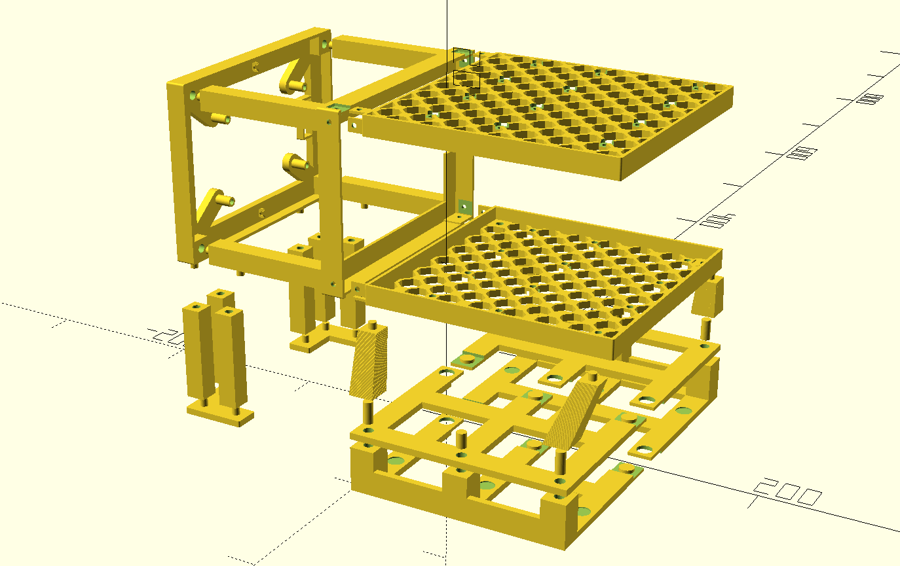

LJ's NAS Project
================

Chasis design
-------------

I am not exactly proud of it, but it's not bad for the first design ever and it
does the job. All the necessary files needed to 3D print it are in the
`chassis-design` directory. To compile the OpenScad design to STL files run the
`build.sh` script.

